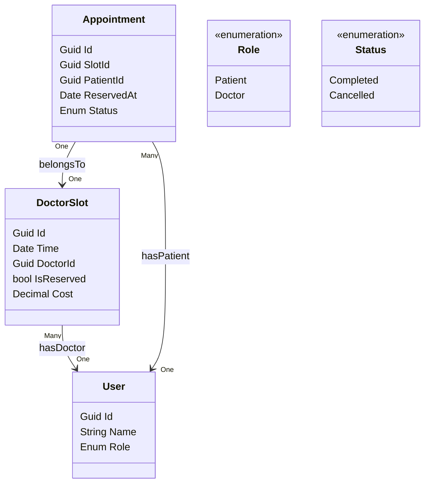

# Software-Architecture

```mermaid
classDiagram
direction TB
    class DoctorSlot {
            Guid Id
            Date Time
            Guid DoctorId
            bool IsReserved
            Decimal Cost
    }

    class Appointment {
            Guid Id
            Guid SlotId
            Guid PatientId
            Date ReservedAt
            Enum Status
    }

    class User {
            Guid Id
            String Name
            Enum Role
    }


    class Role {
        <<enumeration>>
        Patient
        Doctor
    }

    class Status {
        <<enumeration>>
        Completed
        Cancelled
    }


    Appointment "One" --> "One" DoctorSlot : belongsTo
    DoctorSlot "Many" --> "One" User : hasDoctor
    Appointment "Many" --> "One" User : hasPatient
```
